创建项目
 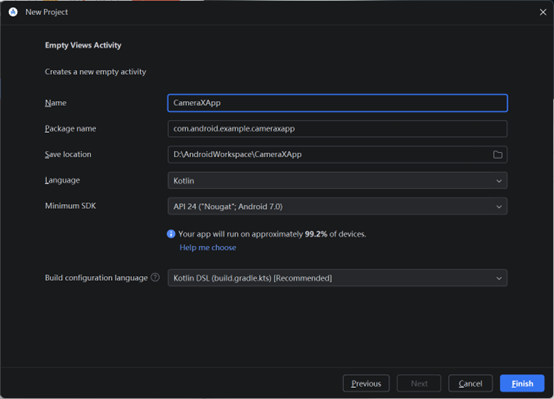
添加 Gradle 依赖
  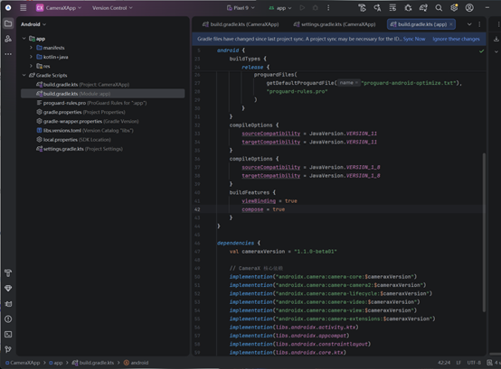
创建项目布局
  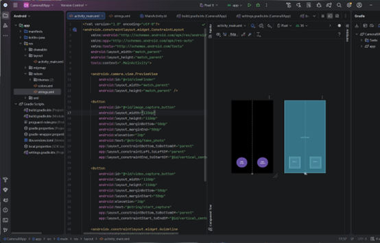
编写 MainActivity.kt 代码
  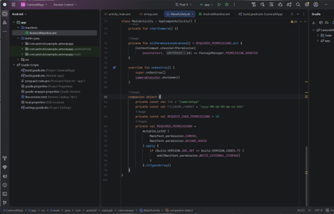
请求必要的权限
  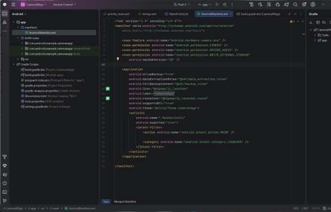
运行应用，可发现应用程序请求使用摄像头和麦克风：
  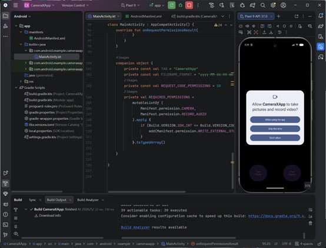
实现 Preview 用例
  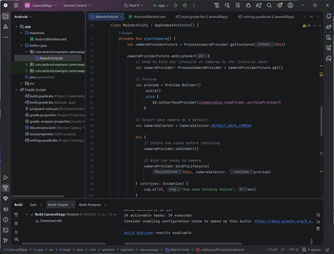
最后，运行应用，可以看到相机预览
  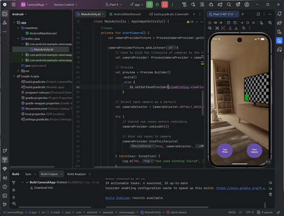
实现 ImageCapture 用例（拍照功能）
  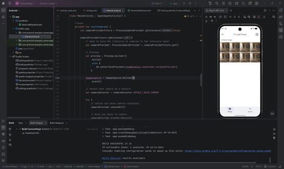
实现 ImageAnalysis 用例
  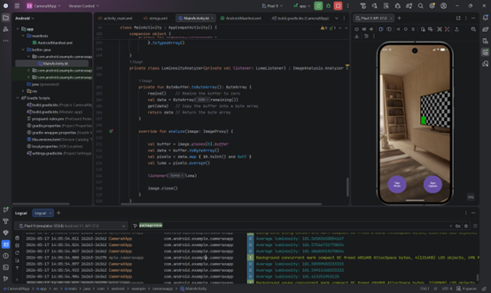
实现 VideoCapture 用例（拍摄视频）
  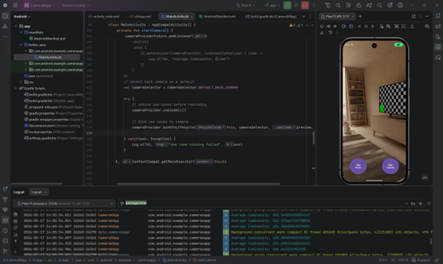
