1.	安装Android Studio
 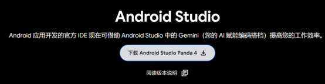
  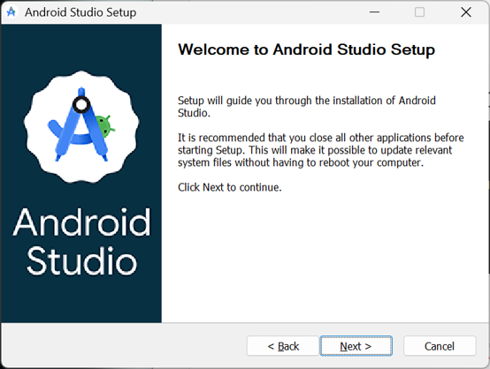
  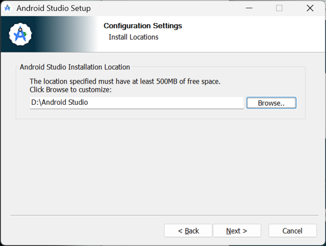
 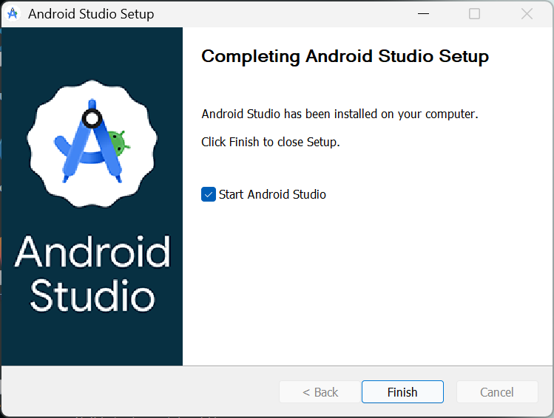
  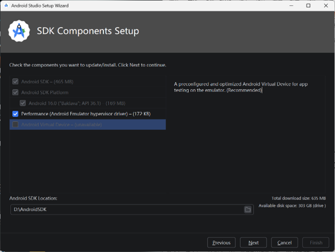
  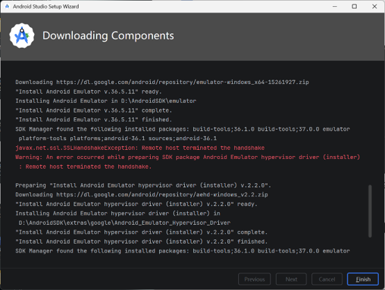
  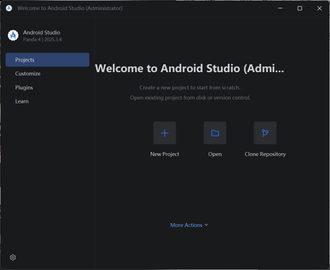
  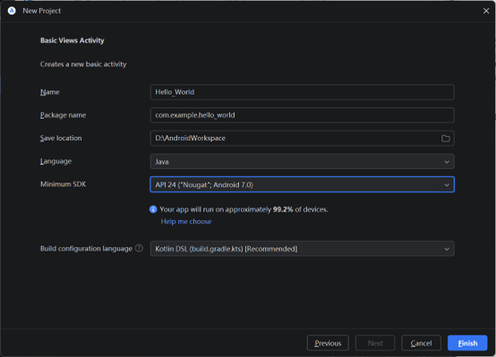
修改镜像源及下载依赖
   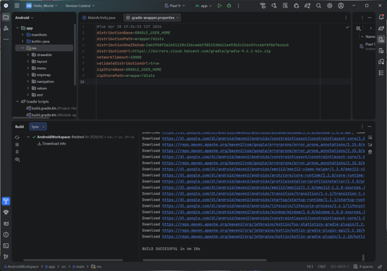
下载虚拟化设备
   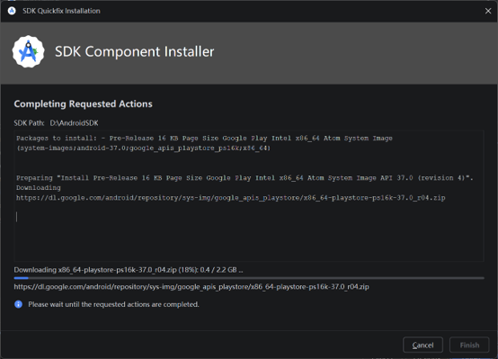
输出打印Hello World
   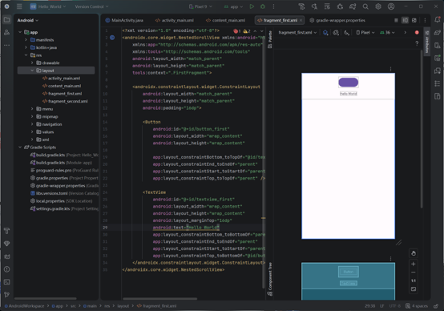
2.	安装Jupyter Notebook和相关Python环境Anaconda
Python版本号
   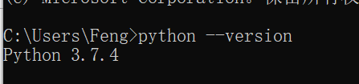
Jupyter Notebook 安装成功
   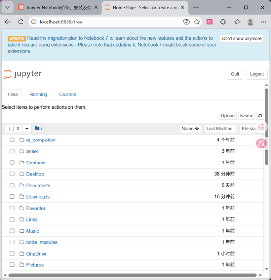
anaconda安装成功
   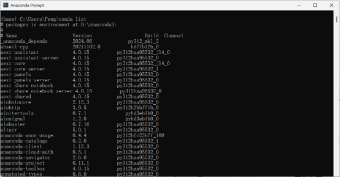
启动Anaconda Navigator导航界面，并从导航界面启动Jupyter Notebook
   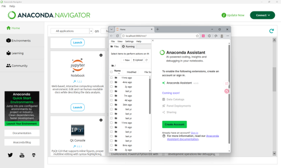
新建一个Notebook（Python 3），查看界面布局，并尝试写一些文本和代码
   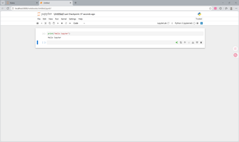
3.	安装Visual Studio Code代码编辑器
安装完成之后， 下载并安装Python， Jupyter， JupyterKeymap等插件
   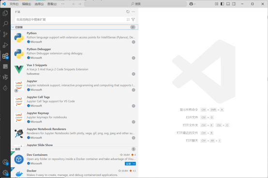
